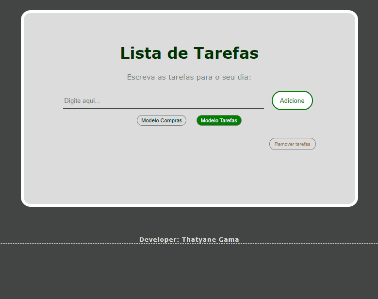

<h1>To Do List - Project</h1>

\/ Write down the tasks you need to do during the day

\/ My first project with JS

\/ localStorage applied

  
- [x] HTML
- [x] CSS
- [x] JavaScript

 
<h1>

</h1>
 
 

By the way,

here is what I still want to do on it:

- [ ] Character Counter
- [ ] Allow changing the position of tasks

 
 
<h2>Made by Thatyane Gama</h2>